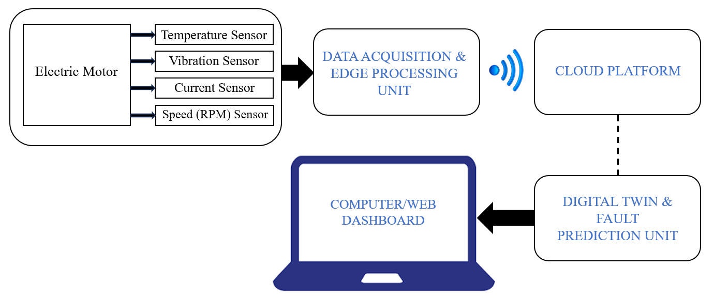
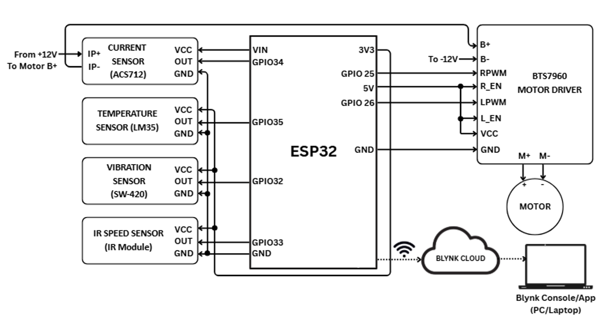
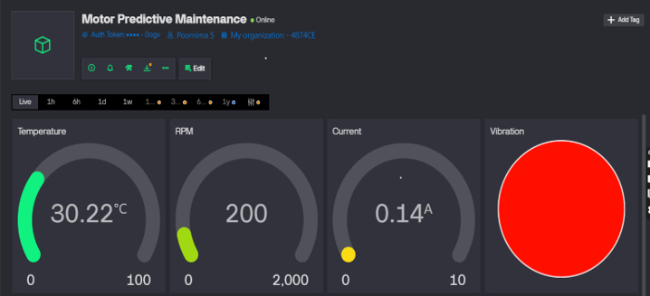
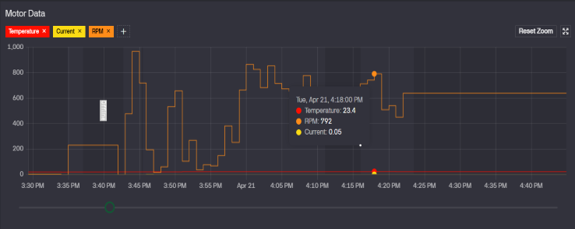
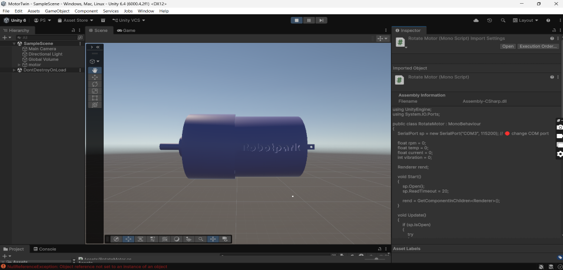

# IoT-Based Digital Twin Framework for Predictive Maintenance of Motor

## Project Status
🚧 Ongoing Final Year Project (2 Semester Project)

## Overview
This project focuses on developing an IoT-enabled Digital Twin framework for predictive maintenance of industrial motors.  

The system continuously monitors motor health parameters such as vibration, temperature, current, and RPM using sensors connected to ESP32. The collected sensor data is transmitted to a cloud dashboard for real-time monitoring and synchronized with a Digital Twin model for visualization and future fault prediction.

---

## Project Architecture

### Block Diagram



### Interfacing Diagram



---

## Work Completed So Far

### Hardware Development
- ESP32 interfacing completed  
- Sensor connections completed  
- Motor setup completed  
- Hardware integration testing completed  

### Cloud Dashboard Development
- Blynk dashboard created  
- Real-time monitoring tested  
- Sensor data successfully transmitted to cloud dashboard  

### Blynk Dashboard Preview




---

### Digital Twin Development
- Basic Unity model created  
- Initial digital twin framework prepared  
- Motor visualization completed  

### Unity Digital Twin Preview



---

### Mechanical Design
- Enclosure design prepared  
- Component arrangement finalized  

---

## Hardware Components Used

- ESP32 Development Board  
- SW420 Vibration Sensor  
- LM35 Temperature Sensor  
- ACS712 Current Sensor  
- IR Sensor for RPM Measurement  
- BTS7960 Motor Driver  
- 12V DC Motor  
- Power Supply Unit  

---

## Software & Tools Used

- Arduino IDE  
- Blynk IoT Platform  
- Unity Engine  
- GitHub  
- Embedded C / Arduino Programming  

---

## Firmware / Embedded System Code

The system uses an ESP32 microcontroller programmed using Arduino IDE to collect real-time sensor data and transmit it to the cloud dashboard.

### Functions Implemented

- LM35 temperature sensor reading  
- ACS712 current sensor monitoring  
- SW420 vibration sensor monitoring  
- IR sensor based RPM calculation  
- Motor speed control using BTS7960 driver  
- Real-time Blynk cloud communication  
- Serial communication with Unity Digital Twin  
- Current sensor auto calibration  

### Source Code

The embedded firmware is available in:

```text
firmware/esp32_code.ino
```

### Libraries Used

- WiFi.h  
- BlynkSimpleEsp32.h  
- BlynkTimer  
---

## Working Principle

1. Sensors continuously monitor motor parameters  
2. ESP32 collects sensor data from connected modules  
3. Data is transmitted to Blynk cloud dashboard  
4. Dashboard displays real-time motor parameters  
5. Digital Twin model visualizes motor behavior  
6. Future integration with machine learning for fault prediction  

---

## Work in Progress

- Machine Learning based fault prediction  
- Digital Twin real-time synchronization  
- Final testing and validation  
- Predictive maintenance algorithm development  
- Fault detection analysis  

---

## Future Scope

- AI-based fault prediction model  
- Industrial scale deployment  
- Mobile app integration  
- Advanced predictive maintenance analytics  
- Real-time anomaly detection  

---

## Repository Structure

```text
iot-digital-twin-predictive-maintenance/

├── dashboard/
│   ├── blynk_dashboard.md
│   └── dashboard screenshots
│
├── diagrams/
│   ├── Block Diagram.png
│   ├── Interfacing Diagram.png
│   └── project_diagrams.md
│
├── digital_twin/
│   ├── unity_model.png
│   └── unity_progress.md
│
├── hardware/
│   └── component_list.md
│
└── README.md
```

---

## Author

**Poornima S**  
Electronics and Instrumentation Engineering  
Siddaganga Institute of Technology, Tumakuru  

---

## Project Goal

To develop a smart predictive maintenance system capable of monitoring motor health in real time and predicting failures before breakdown occurs using IoT and Digital Twin technology.
